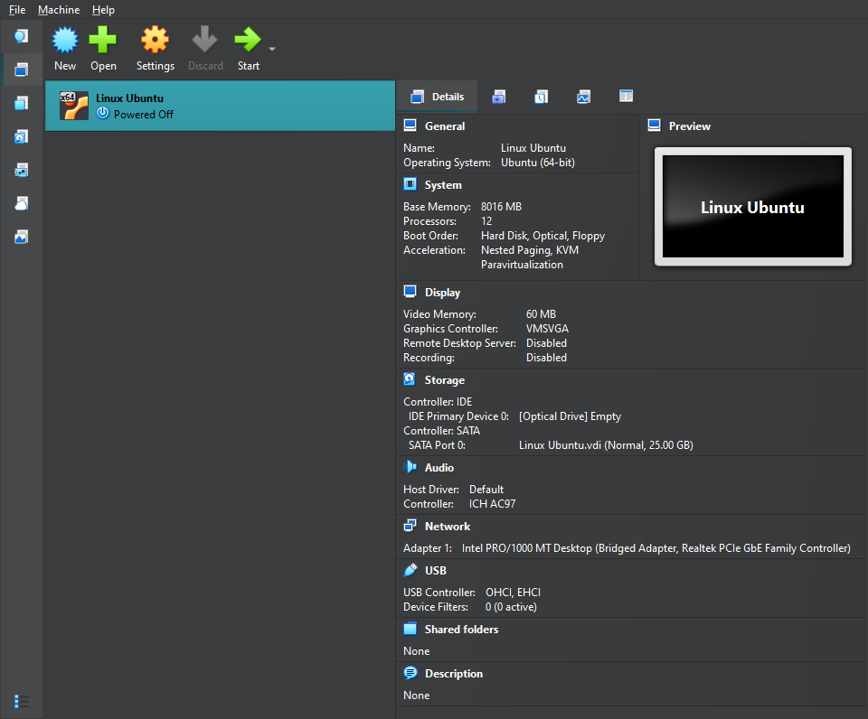
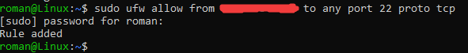
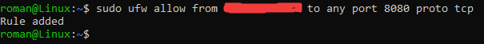

# Проект "Task-URL-Platform"

Для продолжения проекта мы будем использовать CI/CD, graphana и prometheus, backup's Postgre.

# Выбор удаленного сервера

Поскольку VPS по типу (yandex cloud, selectel) довольно дороги и не понятны в использовании я решил продолжить проект используюя подключение к ВМ на моем пк. (Linux Ubuntu)





# Настройка подключения по ssh к VM

Для подключения к ВМ мы будем использовать ssh-подключение. Для этого в настройках ВМ делаем примерно так в Network:


Далее настраиваем подключение не по паролю, а по ssh-ключу 

Для этого:
- Создаем ssh-ключ на windows(cmd):

```
    ssh-keygen -t ed25519
```

- Далее либо сразу копируем новый ssh-ключ либо с помощью команды достаем его и копируем, команда(cmd):

```
    type C:\Users\Рома\.ssh\id_ed25519.pub
```

- Далее вставляем новый ssh-ключ на нашем linux-сервере по пути:

```
    nano ~/.ssh/authorized_keys #добавляем строку с нашим ssh-ключом и сохраняем
```

- Настраиваем подключение без паролей, только по ssh:

```
    sudo nano /etc/ssh/sshd_config
```

- Добавляем или изменяем строки:

```
    PubkeyAuthentication yes
    PasswordAuthentication no
    PermitRootLogin no
```

- Перезапускаем сервис ssh:

```
    sudo systemctl restart ssh
```

- Пробуем подключаться через cmd:

```
    ssh name@ip #Должно автоматически подключиться без паролей
```

## Firewall

- Настраиваем ВМ на подключение только с нашего ip :

```
    sudo ufw allow from Наш_ip to any port 22 proto tcp
```




## Nginx

- Настраиваем подключение к nginx тоже только с нашего ip

```
    sudo ufw allow from Наш_ip to any port 8080 proto tcp
```





После этого я бросил работу с ВМ из-за того что она адекватна не работала.