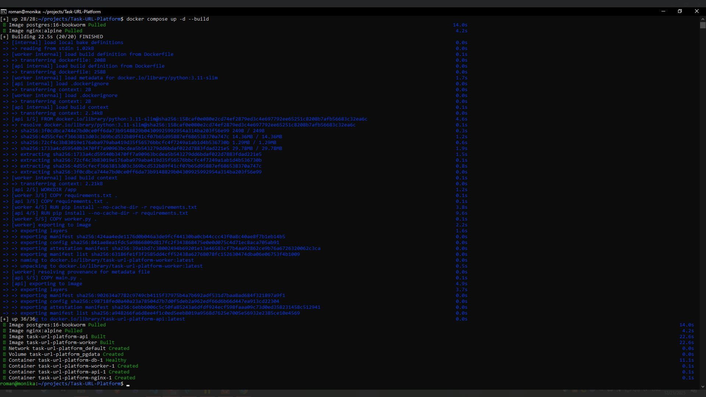
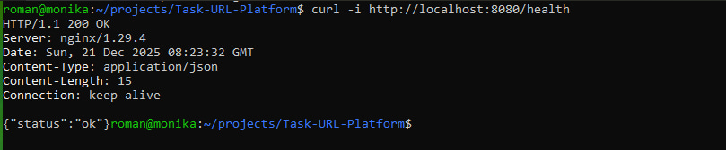
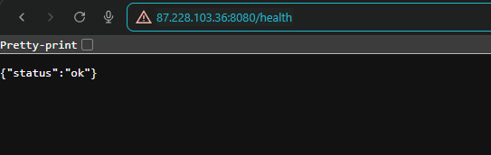

## Клонируем репозиторий.

```
    git clone ссылка-на-репозиторий
```

- Запускаем приложение

```
    docker compose up -d --build
```





- Проверяем работу приложения:





- Так же проводим ssh-тунель и получаем возможность открывать ссылку со своего пк.


