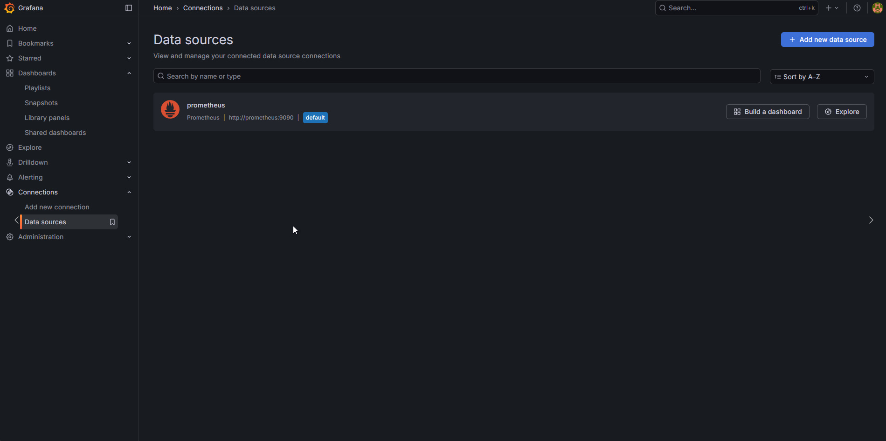
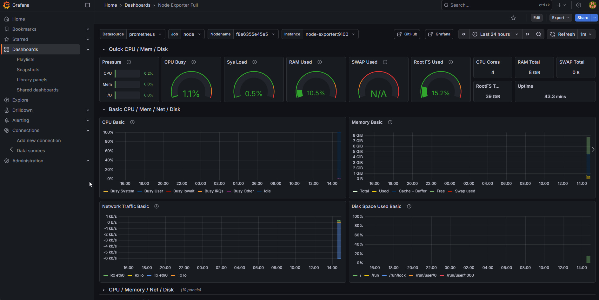

## Подключаем Graphana и Prometheus:


Закрываем порты для безопасности:

```
    sudo ufw deny 3000/tcp
    sudo ufw deny 9090/tcp
    sudo ufw deny 8081/tcp
    sudo ufw status
```


- Подключаемся к graphana по адрессу ip:9090 (admin admin login and password)

- Добавляем prometheus в graphana:





- Добавляем Dashboard:



