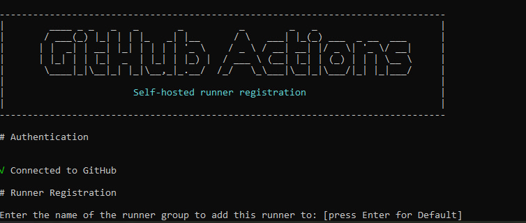

## Настраиваем CI/CD:
- (GitHub Actions + GHCR + self-hosted runner)

- CI (в GitHub Actions): собирает Docker-образы api и worker, пушит в GHCR с тегом sha-<commit>.

- CD (в GitHub Actions на self-hosted runner): на VPS делает docker compose pull/up и проверяет /health.


## Подготовка VPS для CD

- На VPS должен быть установлен Docker + compose plugin.

На сервере хранится папка деплоя (пример):

```
    /home/roman/projects/Task-URL-Platform
```

там лежат docker-compose.prod.yml, .env, nginx/nginx.conf

В docker-compose.prod.yml api и worker берутся из GHCR:

ghcr.io/<owner>/<repo>/api:${IMAGE_TAG}

ghcr.io/<owner>/<repo>/worker:${IMAGE_TAG}

## Self-hosted runner на VPS

По инструкциям Github -> Actions -> runners настраиваем наш runner:





## CI: build + push images в GHCR

- Workflow собирает и пушит два образа в GHCR с тегом:

```
    sha-${{ github.sha }}
```

- Важное:

    логин в GHCR делаем через GITHUB_TOKEN

    после CI в GHCR должны появляться:

```
.../api:sha-<commit>

.../worker:sha-<commit>
```

## CD: deploy на VPS

- Deploy job запускается на runs-on: self-hosted и делает:

```
    cd /home/roman/projects/Task-URL-Platform
    IMAGE_TAG="sha-<commit>" docker compose -f docker-compose.prod.yml --env-file .env pull
    IMAGE_TAG="sha-<commit>" docker compose -f docker-compose.prod.yml --env-file .env up -d
    docker compose -f docker-compose.prod.yml --env-file .env restart nginx
```

- Затем ждем пока сервис оживет:

```
    curl -fsS http://localhost:8080/health
```

## Проверяем что деплой применился:

- docker ps - контейнеры имеют тег в виде latest commit


## Частые проблемы

```
    IMAGE_TAG variable is not set → запускали prod compose без IMAGE_TAG=...
```

```
    502 from nginx after deploy → решается docker compose restart nginx
```

```
    not found/denied при pull из GHCR → CI не запушил тег или нет доступа к GHCR (пакет приватный/логин)
```